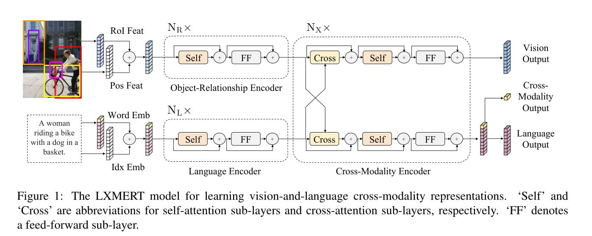
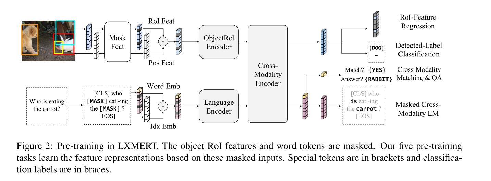

# LXMERT
```bash
VQA的任务需要结合视觉和文本两种模态的信息来得出最终答案，所以对模型的一个基本的要求就是要具有跨模态分析的功能（如果是KVQA即基于知识库的视觉问答任务则需要更进一步的跨模态推理的能力）。此篇文章使用双路的Transformer结构，使用三种Encoder通过五种预训练方式来赋予模型的跨模态能力，Encoder分别为：对象关系编码器、语言编码器、跨模态编码器。
```


```bash
语言和视觉输出均是由Cross-Modality Encoder处理后的特征序列。跨模态输出的部分取自对应语言特征的CLS。
```
# 多模态
```bash
之前的多模态任务是怎么做的，为什么现在大家会转向Transformer做多模态任务？

在Transformer，特别是Vision Transformer出来打破CV和NLP的模型壁垒之前，CV的主要模型是CNN，NLP的主要模型是RNN，那个时代的多模态任务，主要就是通过CNN拿到图像的特征，RNN拿到文本的特征，然后做各种各样的Attention与concat过分类器，使用这种方式构造出来的多模态模型会大量依赖各种模型输出的特征进行多重操作，pipeline巨大并且复杂，很难形成一个end2end的方便好用的模型

但是Transformer，特别是ViT(Vision Transformer)出来之后，这个模型壁垒就被打破了，人们发现原来对付图像和文本都可以使用同一个模型，那么处理多模态的任务，就直接使用把两种模态输进这个模型，然后接上自己的下游任务，省时省力end2end，还能把精力更多放在任务而不是特征如何concat和attention上

因为不同模态的输入都可以转化为一维序列，那么不同模态可以同时作为Transformer的输入来处理，这样子就能够解决多模态输入不统一的核心痛点。

self-attention的序列特征提取功能其实是非常强大的，如果你用CNN，那么一次提取的特征只有一个限定大小的矩阵，如果在句子里做TextCNN，那就是提取一小段文字的特征，最后汇聚到一起；如果做RNN，那么会产生长程依赖问题，当句子 太长最后RNN会把前面的东西都忘掉。self-attention既消除了RNN的并行度和遗忘问题，也消除了CNN的最长路径问题

多模态任务的核心难点在于：不同模态的信息如何融合。而Dot-product Attention就给出了一种简单且有效的融合方案，在Dot-product Attention中，首先计算  的每个成分之间的相似度，然后根据  后的相似度信息的分数（代表着重要性），来调节模态  中的信息。
```
# 多模态预训练
```bash
学术界关于Visual-Language模型的论文有几十上百篇，但是它们大多数都遵循同一个框架，包含五大模块，分别为Vision Encoder、Text Encoder、Multimodal Fusion、是否包含Decoder以及预训练任务。不同的VLP论文主要对这5个模块进行不同的设计。

Visual Encoder：Visual Encoder主要包括3种类型。第一种类型为使用object detection模型（一般为Faster R-CNN）识别图像中的目标区域，并生成每个目标区域的特征表示，输入到后续模型中。第二种方式是利用CNN模型提取grid feature作为图像侧输入。第三种方式是ViT采用的将图像分解成patch，每个patch生成embedding输入到模型中。随着Vision-Transformer的发展，第三种方式逐渐成为主流方法。本文主要研究的Visual Encoder是第三种，相比前两种方式运行效率更高，不需要依赖object detection模块或前置的CNN特征提取模块。

Text Encoder：包括诸如BERT、RoBERTa、ELECTRA、ALBERT、DeBERTa等经典预训练语言模型结构。

Multimodel Fusion：主要指的是如何融合图像侧和文本侧Encoder输出的表示。主流方法包括2种。一种被称为co-attention，图像侧和文本侧分别使用Transformer编码，在每个Transformer模块中间加入图像和文本之间的cross attention。另一种方式被称为merged attention model，图像侧和文本侧的信息在最开始就被拼接到一起，输入到Transformer模型中。其中，merged attention model方法的参数量相对更少。

Pretraining Objectives：历史工作提出了很多预训练阶段的目标任务，主要可以分为3大类。第一类是Masked Language Modeling（MLM），随机遮盖掉部分token，使用其他的token以及图像信息预测被遮盖住的token，类似于Bert中的MLM。第二类是Masked Image Modeling，对输入的部分图像region或patch进行mask，然后预测被mask掉部分的目标类别，或者基于回归任务还原被mask掉部分的像素。第三类是Image-Text Matching（ITM）任务，预测image和text的pair对是否匹配，对比学习的预训练方法也可以放在这个类别中。
```

```bash
对抗训练（adversarial training）是增强神经网络鲁棒性的重要方式。在对抗训练的过程中，样本会被混合一些微小的扰动（改变很小，但是很可能造成误分类），然后使神经网络适应这种改变，从而对对抗样本具有鲁棒性。

对抗训练其实是一种混淆梯度的方式，增加训练时间，让神经网络拟合正常样本和有扰动的样本，这样，它要记忆一个in-distribution的数据分布以及一个perturbation的数据分布。对抗训练（Adversarial Training），顾名思义，就是在训练过程中产生一些攻击样本，早期是FGSM和I-FGSM攻击，目前当前最优的攻击手段是PGD。对抗训练主要是一种博弈训练的方式，借鉴了强化学习的思路，最大化扰动的同时最小化对抗期望风险。
```
# 数据集
- VQA2

- NLVR2
```bash
给模型一对图像与一个句子，判断这句话正确与否。这个数据集的特点在于compositional reasoning，我们需要模型理解图像中的物体的属性，物体与物体的关系，物体与场景的关系。

我们通过修改句子或用网络搜索中获得自由许可的图片替换其中一张图片来构建NLVR2的Contrast Set。

比如将句子"The leftimage contains twice the number of dogs as theright image"改为“The left image containsthree timesthe number of dogs as the right image”。或者对一个图像对，将原本4条狗的图像换成其他数目。也可以对一些量词比如"at least one"改为"exactly one"，或者实体"dogs"改为"cats"，或者属性"yellow"改为“red”。
```
- SNLI-VE
```bash
视觉蕴涵（VE）是一种细粒度的视觉推理任务，用于预测图像在语义上是否包含文本。在追求视觉智能的过程中，VE任务中图像和文本对之间的关系比VQA和NLVR更细粒度，后者可以是真（蕴涵）、假（矛盾）或中性。SNLI-VE数据集[42]是针对VE任务提出的，基于斯坦福自然语言推理（SNLI）[5]和Flickr30K[30]数据集构建。
```
- Visual Commonsense Reasoning(VCR)
```bash
VCR是用于视觉常识推理的大规模数据集，包含约290K问题、答案和解释对，涵盖超过110K不重复的电影场景。
任务描述大致如下：给图片，给区域，给问题，模型必须在选择题中选出一项，选出了这个选项之后还要做个选择题，你为什么选了这个选项
```